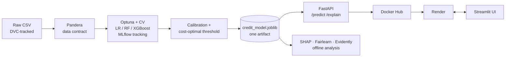

# 🔍 CreditLens

**Cost-sensitive, explainable and fairness-audited credit-risk scoring** - an end-to-end ML project
on the German Credit dataset: from data contract and experiment tracking to a containerised API,
CI/CD, a Streamlit app and drift monitoring.

## Orientation - start here
This is a **fresh, unbuilt copy**: source code only. No trained model, no generated reports or
figures, no notebook output, no `.git`, and no initialized `.dvc/` - everything here is reproducible
from source and from `dvc.yaml`/`params.yaml`, not shipped as pre-built state. Two ways to look at it:

* **Browsing (no setup):** read this README, then `src/creditlens/` (the pipeline logic, in the
  order data → features → pipeline → cost → train → evaluation → explain → fairness → monitoring),
  `api/` (the service), `app/streamlit_app.py` (the UI), and `docs/DEPLOYMENT.md`. `notebooks/01_eda.ipynb`
  is unrun by design - open it in an editor to read the analysis narrative, or execute it to see the plots.
* **Running it:** follow *Quick start* below. `dvc repro` regenerates the trained model, every figure,
  the fairness audit and the drift reports in a few minutes; `pytest` (48 tests) does not need any of
  that and runs against synthetic data + a freshly trained model fixture.

| | |
|---|---|
| **Live app** | `https://creditlens.streamlit.app` *(after you deploy - see [docs/DEPLOYMENT.md](docs/DEPLOYMENT.md))* |
| **API docs** | `https://creditlens-api.onrender.com/docs` *(after you deploy)* |
| **Stack** | Python 3.12 · pandas · scikit-learn · XGBoost · imbalanced-learn · Optuna · MLflow · SHAP · Fairlearn · Pandera · Evidently · DVC · FastAPI · Streamlit · Docker · GitHub Actions · Render |

## The problem
A lender must approve or decline loan applications. Approving a loan that defaults is far more
expensive than declining one that would have been repaid (UCI cost matrix: **5 : 1**). So the goal is
not accuracy - it is **minimum expected cost**, with decisions that can be explained to the applicant
and audited for fairness.

## What running the pipeline produces
`dvc repro` trains the model and writes `reports/results.md` and `reports/fairness_audit.md`. On the
run performed during development:

| | |
|---|---|
| Best model | XGBoost, CV ROC-AUC **0.774** (LR 0.752, RF 0.768 - differences are within one std) |
| Held-out test | ROC-AUC **0.758** (95% CI 0.68-0.83), 200 applicants |
| Decision rule | Decline if calibrated P(default) ≥ **0.15** (chosen on out-of-fold data by minimising expected cost) |
| Business impact | Cost / applicant **0.625** vs 0.700 "decline everyone" and 0.900 at the naive 0.5 threshold |
| Fairness | Model uses **neither sex nor age** (audit: −0.003 / −0.007 AUC, large drop in disparity) |
| Explainability | Checking account, loan duration and credit amount dominate; exact per-applicant SHAP in the API |

Optuna and SMOTE are seeded (`params.yaml: seed`), so re-running should reproduce these closely, but
treat the numbers above as an example of what the pipeline reports, not a claim about this specific
copy of the repo - regenerate them yourself with `dvc repro` and read the full write-up it produces.

**Honest caveats you'll see in that write-up:** the test set is small - the saving vs. "decline
everyone" was 11% on test (CI included 0) and 23% out-of-fold on the run above; the cost-optimal
policy is conservative (~2/3 of applicants declined); and age-related disparity **persists through
proxy features** even after removing the age column.

## Architecture


**Design decisions worth knowing**
* **One artifact, no train/serve skew.** `CreditRiskModel` bundles preprocessing, classifier,
  calibrator and threshold. Training, tests and the API all use it.
* **Leakage-safe.** Feature engineering is stateless; SMOTENC (for mixed categorical/numeric data), scaling
  and encoding live inside the CV pipeline. The test set is evaluated exactly once.
* **Missing ≠ noise.** Missing account info means "no account" and is the *safest* group (12% bad vs 49%
  for "little" balance) - it becomes an explicit category, never imputed.
* **Calibrated probabilities.** Class weighting distorts probabilities; a Platt calibrator fitted on out-of-fold
  predictions makes them usable (Brier 0.194 → 0.169) and puts the tuned threshold (0.15) next to the
  theoretical optimum 1/6.
* **Lean API image.** Explanations use XGBoost's native TreeSHAP (verified identical to `shap`), so the
  image excludes shap, mlflow, optuna and imbalanced-learn.
* **Fairness as a decision, not an afterthought.** Four model variants compared with Fairlearn before
  deciding which attributes may be used.
* **Protected attributes rejected at the API boundary** (`extra="forbid"` → HTTP 422 for `sex`/`age`).

## Quick start
```bash
python3.12 -m venv .venv && source .venv/bin/activate
pip install -r requirements-dev.txt && pip install -e . --no-deps

git init                      # optional but recommended before the next line
dvc init                      # or `dvc init --no-scm` if you'd rather skip git for now
dvc add data/raw/german_credit_data.csv   # starts DVC-tracking the raw dataset

pytest                        # 48 tests - synthetic data, no pipeline run required
dvc repro                     # validate -> train -> evaluate -> explain -> fairness -> monitor
                               # creates models/, reports/, reports/figures/ and writes into them
uvicorn api.main:app --reload # http://localhost:8000/docs  (needs the model from dvc repro)
CREDITLENS_API_URL=http://localhost:8000 streamlit run app/streamlit_app.py
mlflow ui --backend-store-uri sqlite:///mlflow.db
docker build -t creditlens-api . && docker run -p 10000:10000 creditlens-api
```
Every output directory (`models/`, `reports/`, `reports/figures/`, `data/processed/`) is created
on demand by the code that writes into it (`Path.mkdir(parents=True, exist_ok=True)`) - none of them
need to exist beforehand.
Example request:
```bash
curl -X POST localhost:8000/explain -H 'content-type: application/json' -d '{
  "job": 2, "housing": "own", "saving_accounts": "little", "checking_account": "moderate",
  "credit_amount": 4500, "duration": 24, "purpose": "car"}'
```

## Repository layout
```
├── src/creditlens/     config · data · schema (Pandera) · features · pipeline · cost · model
│                       train (Optuna+MLflow) · evaluation · explain (SHAP) · fairness · monitoring
├── api/                FastAPI app + Pydantic schemas
├── app/                Streamlit UI (thin client of the API)
├── notebooks/          01_eda.ipynb (executed; insights → modelling decisions)
├── tests/              48 tests: data contract, features, pipeline, cost logic, API, UI
├── reports/            created by `dvc repro`: results.md · fairness_audit.md · figures/ · monitoring/
├── models/             created by `dvc repro`: credit_model.joblib (must exist before `docker build`)
├── dvc.yaml            reproducible pipeline (6 stages) · params.yaml = single source of parameters
├── Dockerfile · .github/workflows/{ci,deploy}.yml · .pre-commit-config.yaml
└── docs/DEPLOYMENT.md  step-by-step Render / Docker Hub / Streamlit / DagsHub setup
```

## Monitoring
`python -m creditlens.monitoring` (part of `dvc repro`) builds Evidently reports comparing training data
with (a) a stable batch and (b) a simulated downturn (bigger/longer loans, more business loans, thinner
bank records). On the development run, the stable batch flagged 1/8 columns (a chance false alarm at
p < 0.05); the downturn flagged 5/8, **including the model's own predicted risk**, and raised the decline
rate from 68.5% to 77.0%. Reports land in `reports/monitoring/*.html` after you run the pipeline.

## Limitations
* 1,000 rows from a 1990s German dataset; currency is Deutsche Mark; no time dimension.
* Cost matrix ignores interest income; outcomes exist only for approved loans (no reject inference).
* Tiny groups (e.g. 113 applicants over 50) make fairness estimates noisy.
* **Demo only - not for real lending decisions.**

## Data
[Statlog (German Credit Data)](https://archive.ics.uci.edu/dataset/144/statlog+german+credit+data), Prof. Hans Hofmann, University of Hamburg (via UCI / Kaggle).
